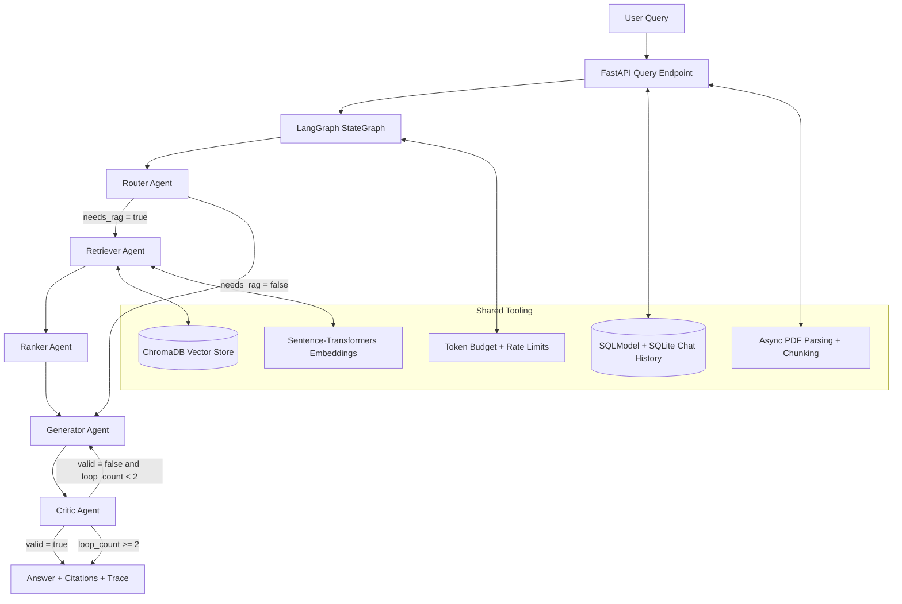

# Agentic AI Research Assistant on Azure

Production-grade, multi-agent RAG platform for document-grounded question answering with traceable reasoning, citation-aware responses, and cloud-native container operations.

## Frameworks & Tech Stack

| Layer | Frameworks / Technologies |
|---|---|
| LLM + Agentic Orchestration | LangGraph, LangChain, LangChain Community, LangChain HuggingFace, LangChain Groq, Groq LLM API |
| Retrieval + Embeddings | ChromaDB, sentence-transformers (all-MiniLM-L6-v2), PyTorch, Transformers |
| Backend API | FastAPI, Uvicorn, Pydantic, Pydantic Settings, SQLModel, Python Multipart, Tenacity |
| Document Processing | PyMuPDF |
| Data Layer | SQLite, Chroma persistent collections |
| Frontend | React.js, React Router, Vite, Lucide React |
| Edge / Reverse Proxy | Nginx |
| Containers | Docker, Docker Compose, Docker Buildx |
| CI/CD | GitHub Actions, pytest, HTTPX |
| Azure Deployment | Azure Container Registry (ACR), Azure Container Apps (ACA), Azure Resource Group, Azure CLI, Azure IAM credentials (AZURE_CREDENTIALS) |

## Multi-Agent Architecture (RAG Flow)



---

## Phase 1: Dockerization & Registry (ACR)

### 🎯 Objective
Ship a heavy backend image (embedding stack + ML dependencies) reliably and promote immutable artifacts to Azure Container Registry.

### Key Decisions
- Backend image built around Python 3.11 slim with optimized dependency layering.
- Frontend image uses multi-stage build (Node build stage -> Nginx runtime stage).
- Registry-first strategy ensures deployment consistency and rollback safety.

### Deliverables
- Containerized backend and frontend services.
- Image tagging strategy ready for CI/CD promotion.
- ACR-compatible push model for Azure runtime updates.

---

## Phase 2: CI/CD Automation (GitHub Actions)

### ⚙️ Objective
Enforce quality gates and build integrity on every push to main before cloud rollout.

### Workflow Logic
1. Checkout source.
2. Set up Python 3.11.
3. Install backend dependencies.
4. Run backend test suite (pytest).
5. Build backend container image.
6. Build frontend container image.

### Outcome
- Deterministic validation pipeline.
- Early regression detection for code and container definitions.
- Secure path to Azure deployment extension.

---

## Phase 3: Azure Infrastructure

### ☁️ Objective
Provision and operate a clean Azure landing zone for containerized multi-agent inference workloads.

### Provisioned Scope
- Dedicated Resource Group.
- Azure Container Registry for image storage.
- Azure Container Apps environment for managed runtime execution.

### Image: Global Resource Group View


[🔍 View Technical Details in Documentation](documentation.md#phase-3-azure-infrastructure)

---

## Phase 4: Networking & Nginx Reverse Proxy

### 🌐 Objective
Stabilize API routing and HTTPS behavior between frontend ingress and backend services.

### Critical Focus
- SPA routing fallback in Nginx.
- Reverse-proxy normalization for /api requests.
- SSL/TLS alignment for Azure-hosted ingress scenarios.

### Image: Frontend Dashboard (Start/Stop)


[🔍 View Technical Details in Documentation](documentation.md#phase-4-networking--nginx-reverse-proxy)

### Image: Revisions & Scaling Mode


[🔍 View Technical Details in Documentation](documentation.md#scaling-operations)

---

## Phase 5: Cost Control & Hibernation (Scale to 0)

### 💸 Objective
Minimize cloud spend for Azure Students subscriptions using explicit hibernation and on-demand wake-up.

### Strategy
- Scale frontend/backend to zero replicas when idle.
- Resume only for active demos or validations.
- Keep container revisions and configuration intact across sleeps.

### Image: Zero-Replica Status Confirmation


[🔍 View Technical Details in Documentation](documentation.md#phase-5-cost-control--hibernation)

---

## Quick Start (Local)

```bash
docker compose up --build -d
```

Application endpoints:
- Frontend: http://localhost
- Backend API: http://localhost:8000
- OpenAPI docs: http://localhost:8000/docs

Run tests:

```bash
cd backend
pytest -q
```
