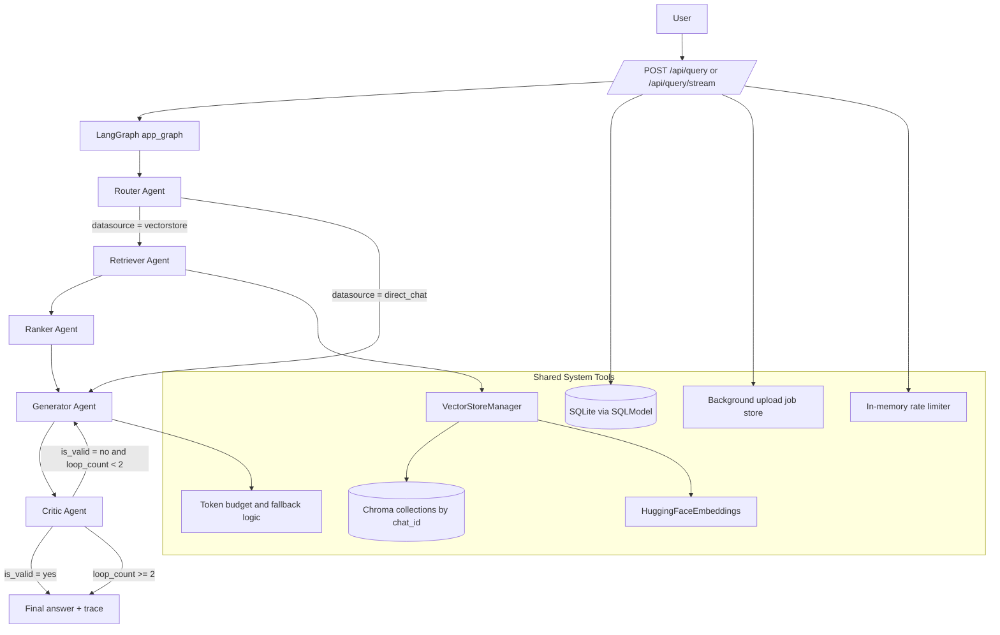
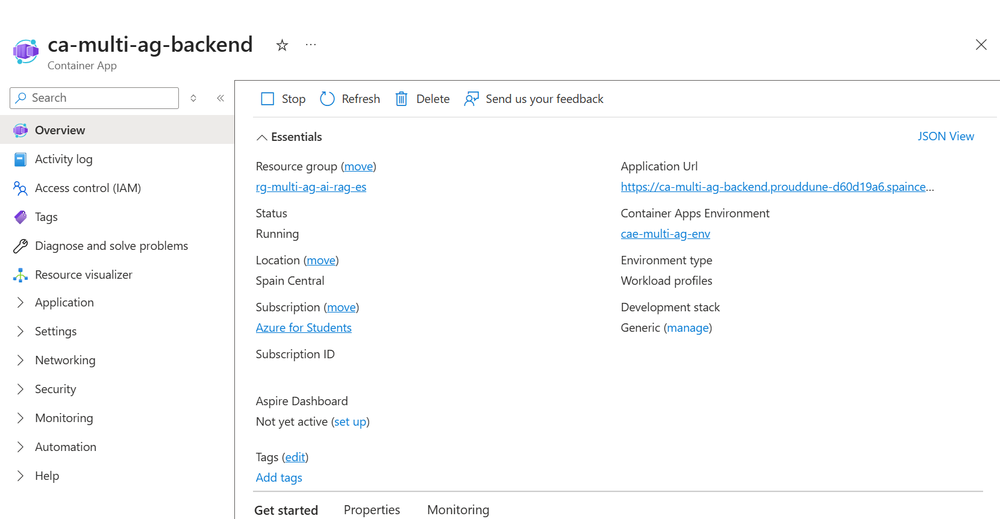

# Agentic AI Research Assistant on Azure

Production-grade, multi-agent RAG platform for PDF-grounded research Q and A with explainable traces, streaming responses, and Azure-native container deployment.

## Tech Stack & Skills

### Languages and Runtime
- Python 3.11
- JavaScript (ES Modules)
- SQL (SQLite)
- YAML

### AI, LLM, and RAG Frameworks
- LangGraph
- LangChain
- langchain-community
- langchain-groq
- langchain-huggingface
- Groq API via ChatGroq
- sentence-transformers (all-MiniLM-L6-v2)
- Transformers
- PyTorch
- ChromaDB

### Backend and API
- FastAPI
- Uvicorn
- Pydantic + pydantic-settings
- SQLModel
- python-multipart
- Tenacity

### Frontend
- React 18
- React Router
- Vite
- Lucide React

### Infrastructure, DevOps, and Cloud
- Docker
- Docker Compose
- Nginx (SPA + reverse proxy)
- GitHub Actions
- pytest + HTTPX
- Azure Container Registry (ACR)
- Azure Container Apps (ACA)
- Azure CLI
- Azure login and docker login GitHub actions

---

## Multi-Agent Architecture (Code-Accurate)



[🔍 View Technical Details in Documentation](documentation.md#multi-agent-architecture)

---

## 🧱 Phase 1: Dockerization and Registry (ACR)

The project is packaged as two containers:
- Backend container on Python 3.11 slim with ML and RAG dependencies.
- Frontend container with a multi-stage build (Node build stage + Nginx runtime stage).

Heavy-image strategy:
- Keep requirements installation before app source copy to improve Docker cache reuse.
- Push immutable image tags in CI for safe roll-forward and rollback.

### Docker Compose Runtime Snapshot


[🔍 View Technical Details in Documentation](documentation.md#phase-1-dockerization-and-registry-acr)

---

## 🔁 Phase 2: CI/CD Automation (GitHub Actions)

Pipeline behavior from the workflow:
1. Run backend tests with environment variables suitable for CI.
2. Authenticate to Azure.
3. Authenticate to ACR.
4. Build and push backend and frontend images tagged with commit SHA.
5. Deploy both services to Azure Container Apps.

### CI/CD Pipeline Evidence


[🔍 View Technical Details in Documentation](documentation.md#phase-2-cicd-automation)

---

## ☁️ Phase 3: Azure Infrastructure

Provisioned cloud boundary:
- Resource group scoped in Spain Central.
- Shared Container Apps environment.
- Separate backend and frontend Container Apps.
- ACR-backed image source.

### Global Resource Group View


[🔍 View Technical Details in Documentation](documentation.md#phase-3-azure-infrastructure)

### Backend Container App Overview


[🔍 View Technical Details in Documentation](documentation.md#phase-3-azure-infrastructure)

### Frontend Container App Overview


[🔍 View Technical Details in Documentation](documentation.md#phase-3-azure-infrastructure)

### Frontend Dashboard (Start/Stop)


[🔍 View Technical Details in Documentation](documentation.md#phase-3-azure-infrastructure)

### Public Azure Deployment Validation


[🔍 View Technical Details in Documentation](documentation.md#phase-3-azure-infrastructure)

---

## 🌐 Phase 4: Networking, Nginx Reverse Proxy, and Application UX Validation

Network behavior implemented:
- SPA fallback through try_files for React routes.
- Reverse proxy from frontend /api to backend HTTPS endpoint on Azure Container Apps.
- TLS SNI fix using proxy_ssl_server_name on; for Azure certificate hostname validation.

### Main Interface (Forest Theme)
.png>)

[🔍 View Technical Details in Documentation](documentation.md#phase-4-networking-and-nginx)

### Theme Variant: Sombre Classique


[🔍 View Technical Details in Documentation](documentation.md#phase-4-networking-and-nginx)

### Theme Variant: Clair Épuré


[🔍 View Technical Details in Documentation](documentation.md#phase-4-networking-and-nginx)

### Theme Variant: Océan Profond


[🔍 View Technical Details in Documentation](documentation.md#phase-4-networking-and-nginx)

### Theme Variant: Néon Cyber


[🔍 View Technical Details in Documentation](documentation.md#phase-4-networking-and-nginx)

### Multi-PDF Upload Experience


[🔍 View Technical Details in Documentation](documentation.md#phase-4-networking-and-nginx)

### Grounded Q and A Result with Citations
.png>)

[🔍 View Technical Details in Documentation](documentation.md#multi-agent-architecture)

### Agent Trace and Reasoning Visibility


[🔍 View Technical Details in Documentation](documentation.md#multi-agent-architecture)

### Conversation Deletion Flow


[🔍 View Technical Details in Documentation](documentation.md#phase-4-networking-and-nginx)

---

## 💸 Phase 5: Cost Control and Hibernation (Scale to 0)

Student-cost strategy:
- Keep min replicas at 0 when idle.
- Use bounded max replicas to avoid accidental burst cost.
- Resume with explicit scale update before demos.

### Revisions and Scaling Controls


[🔍 View Technical Details in Documentation](documentation.md#phase-5-cost-control-and-hibernation)

### Zero-Replica Operational Confirmation


[🔍 View Technical Details in Documentation](documentation.md#phase-5-cost-control-and-hibernation)

---

## Local Run

```bash
docker compose up --build -d
```

Endpoints:
- Frontend: http://localhost
- API: http://localhost:8000
- OpenAPI: http://localhost:8000/docs

Backend tests:

```bash
cd backend
pytest -q
```
