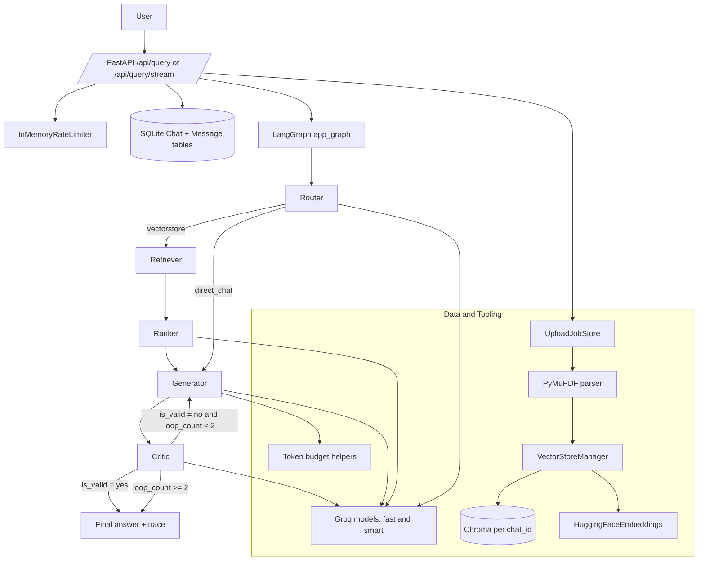

# Technical Documentation: Multi-Agent RAG on Azure

This document explains the real implementation details of this repository: agent orchestration, retrieval pipeline, Docker and deployment strategy, Nginx networking behavior, and Azure cost-control operations.

## Multi-Agent Architecture

The backend uses a compiled LangGraph state machine with five nodes:
- Router
- Retriever
- Ranker
- Generator
- Critic

Execution graph behavior:
1. Router classifies each question to vectorstore or direct_chat.
2. If vectorstore, Retriever queries the chat-scoped Chroma collection.
3. Ranker filters retrieved chunks with a relevance grader and caps context.
4. Generator writes the final answer using grounded context and citation rules.
5. Critic validates grounding and may force a retry loop.
6. Loop exits on valid output or after 2 iterations.

The graph is implemented in backend/app/agents/graph.py with conditional edges:
- router -> retriever or generator
- retriever -> ranker -> generator -> critic
- critic -> end or generator

### Shared State Contract

The state typed dictionary includes:
- question
- chat_id
- documents
- generation
- loop_count
- needs_rag
- is_valid
- agent_steps
- total_tokens

Reducers accumulate agent_steps and total_tokens automatically.

### Agent-Level Behavior and Tools

| Agent | Purpose | Primary tools and model usage |
|---|---|---|
| Router | Intent routing (RAG vs direct) | ChatPromptTemplate + get_fast_llm() + structured output RouteQuery |
| Retriever | Semantic retrieval | VectorStoreManager.search_documents(query, chat_id) -> Chroma similarity_search |
| Ranker | Relevance filtering | get_fast_llm() + structured output GradeDocuments; keeps up to 3 chunks |
| Generator | Final grounded response | get_smart_llm() with fallback to get_fast_llm(); token-budget packing via pack_documents_by_budget |
| Critic | Anti-hallucination gate | get_fast_llm() + structured output GradeHallucinations; validates generation against facts |

### RAG Pipeline Specifics

Upload pipeline details:
- /api/upload accepts multiple PDF files.
- A chat_id is created first and persisted in SQLite.
- Files are queued with per-file status in upload_job_store.
- Background task parses PDFs via PyMuPDF and indexes batches into Chroma.
- /api/uploads/{chat_id}/status supports polling until ready or failed.

Query pipeline details:
- /api/query returns final answer + trace metadata.
- /api/query/stream emits SSE events per node:
	- start
	- agent_step
	- done
	- error
- User and AI messages are persisted in SQLModel tables.

Grounding and budget controls:
- Retrieval top-k default comes from settings.TOP_K_RETRIEVAL.
- Noise chunks are dropped using lexical and alpha-ratio heuristics.
- Generator enforces total budget, safety margin, and context packing.
- Model fallback is automatic on generation failures.

### Mermaid: Code-Accurate Flow



## Phase 1: Dockerization and Registry (ACR)

### Backend Docker Strategy

Current backend image structure:
- Base image: python:3.11-slim
- Build packages installed: build-essential, gcc, g++
- requirements.txt installed before source copy for better cache behavior
- Runtime starts uvicorn app.main:app on port 8000

Important directories created in image:
- /app/db_data
- /app/chroma_data
- /app/data/chroma

This is a single-stage backend image optimized through layer ordering, not a multi-stage backend build.

### Frontend Docker Strategy (Multi-Stage)

Frontend uses a real multi-stage build:
1. node:20-alpine build stage
2. npm install + vite build
3. nginx:stable-alpine runtime stage serving dist assets

This keeps the runtime image minimal and avoids shipping Node build tooling in production.

### Compose Runtime Topology

docker-compose.yml defines:
- backend service mapped to 8000
- frontend service mapped to 80
- persistent volumes for sqlite and chroma directories
- backend environment override CHROMA_PERSIST_DIR=/app/data/chroma

## Phase 2: CI/CD Automation

The workflow in .github/workflows/ci.yml has two jobs:

1. test-and-build
- checkout
- setup Python 3.11
- install backend dependencies
- run pytest

2. deploy-to-azure (needs test-and-build)
- azure/login with AZURE_CREDENTIALS
- azure/docker-login with ACR secrets
- build and push backend image to ACR with github.sha tag
- build and push frontend image to ACR with github.sha tag
- deploy backend via az containerapp up
- deploy frontend via az containerapp up

### GitHub Secrets Handling

Secrets currently required by the workflow:
- AZURE_CREDENTIALS
- ACR_LOGIN_SERVER
- ACR_USERNAME
- ACR_PASSWORD
- GROQ_API_KEY

Security recommendations:
- keep service principal scoped to the deployment resource group
- rotate credentials regularly
- do not echo secrets in logs
- keep deploy job restricted to protected branches

## Phase 3: Azure Infrastructure

Documented deployed resources and naming:
- Resource Group: rg-multi-ag-ai-rag-es
- Container Apps Environment: cae-multi-ag-env
- Backend App: ca-multi-ag-backend
- Frontend App: ca-multi-ag-frontend
- Region: Spain Central

Operational model:
- frontend app exposes user-facing HTTP ingress
- backend app exposes API ingress used by frontend reverse proxy
- images are pulled from ACR in each deployment revision

## Phase 4: Networking and Nginx

Nginx config in frontend/nginx.conf implements:
- listen 80
- root /usr/share/nginx/html
- SPA fallback with try_files $uri $uri/ /index.html
- /api proxy to backend HTTPS endpoint in Azure Container Apps

### Critical SSL/HTTPS Fix

Required directive in this project:

```nginx
proxy_ssl_server_name on;
```

Why this is mandatory here:
- upstream is HTTPS on a hostname-based Azure endpoint
- Azure frontends require correct SNI to return the matching certificate
- without SNI, certificate hostname mismatch can break proxy TLS handshake

Effective proxy block pattern used:

```nginx
location /api/ {
		proxy_pass https://ca-multi-ag-backend.prouddune-d60d19a6.spaincentral.azurecontainerapps.io;
		proxy_ssl_server_name on;
		proxy_http_version 1.1;
		proxy_set_header X-Real-IP $remote_addr;
		proxy_set_header X-Forwarded-For $proxy_add_x_forwarded_for;
		proxy_set_header X-Forwarded-Proto $scheme;
}
```

## Phase 5: Cost Control and Hibernation

The cost model relies on scale-to-zero for student budgets.

### Exact Scale-to-Zero Commands

```bash
az containerapp update \
	--name ca-multi-ag-frontend \
	--resource-group rg-multi-ag-ai-rag-es \
	--min-replicas 0 \
	--max-replicas 1

az containerapp update \
	--name ca-multi-ag-backend \
	--resource-group rg-multi-ag-ai-rag-es \
	--min-replicas 0 \
	--max-replicas 1
```

### Verify Replica Policy

```bash
az containerapp show \
	--name ca-multi-ag-frontend \
	--resource-group rg-multi-ag-ai-rag-es \
	--query "properties.template.scale"

az containerapp show \
	--name ca-multi-ag-backend \
	--resource-group rg-multi-ag-ai-rag-es \
	--query "properties.template.scale"
```

### Resume from Hibernation

```bash
az containerapp update \
	--name ca-multi-ag-backend \
	--resource-group rg-multi-ag-ai-rag-es \
	--min-replicas 1 \
	--max-replicas 2

az containerapp update \
	--name ca-multi-ag-frontend \
	--resource-group rg-multi-ag-ai-rag-es \
	--min-replicas 1 \
	--max-replicas 2
```

## Appendix: Runtime Behaviors Worth Noting

- API supports both blocking and streaming query modes.
- Agent traces are first-class output and include model actions.
- Rate limiting is in-memory and process-local.
- Persistence is currently SQLite and local Chroma directories.
- For larger production workloads, managed external persistence should be planned.
