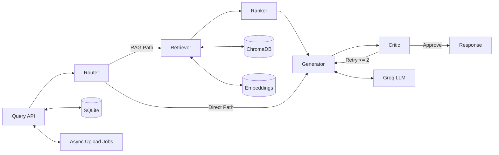
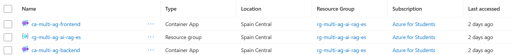
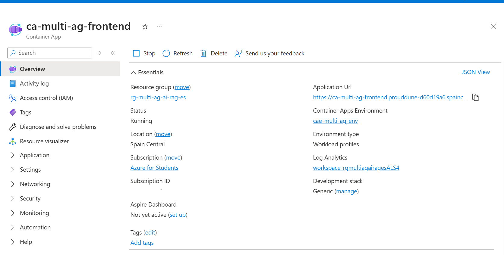

# Technical Documentation: Multi-Agent RAG on Azure

This document provides implementation-level details for architecture, CI/CD, networking, and runtime operations.

## System Summary

| Domain | Implementation |
|---|---|
| Agent Framework | LangGraph over a typed shared state |
| Retrieval | ChromaDB + sentence-transformers embeddings |
| API | FastAPI (session-aware upload/query/chat endpoints) |
| Persistence | SQLModel + SQLite for chats/messages, Chroma persistent collections for vectors |
| Frontend Delivery | React build served by Nginx |
| Runtime | Docker containers on Azure Container Apps |
| Registry | Azure Container Registry |
| CI | GitHub Actions test and image build validation |

## Agent Orchestration

The orchestration graph is stateful and deterministic:

1. Router decides if RAG retrieval is required.
2. Retriever fetches candidate chunks from the chat-isolated collection.
3. Ranker reorders chunks for relevance.
4. Generator produces the answer with grounding context.
5. Critic validates quality and may trigger controlled regeneration.

### State Contract

Core state fields include:
- question
- chat_id
- documents
- generation
- loop_count
- needs_rag
- is_valid
- agent_steps
- total_tokens

Reducers accumulate execution trace and token usage across nodes, enabling transparent auditability and cost visibility.

### Retrieval Integrity

- Collection isolation is keyed by chat_id.
- Upload indexing is asynchronous to keep UX responsive.
- Batched insertion reduces embedding spikes and improves stability under constrained tiers.

## Mermaid: Agent + Tool Topology



## Docker Strategy

### Backend Image Strategy

The backend image is dependency-heavy (ML stack), so layer ordering is critical:
- Base OS + build tooling first.
- requirements installation before source code copy to maximize cache reuse.
- application files copied last to avoid re-installing Python dependencies on small code changes.

This pattern materially reduces CI rebuild time when only Python source changes.

### Frontend Multi-Stage Build

Frontend follows a strict multi-stage model:
- Stage 1 (Node): install dependencies and compile static assets.
- Stage 2 (Nginx): serve only compiled dist output.

Benefits:
- smaller runtime attack surface
- better startup performance
- cleaner separation of build vs runtime concerns

## CI/CD and Secrets

### Current Pipeline Logic

GitHub Actions currently validates:
- backend tests (pytest)
- backend image build
- frontend image build

This is the minimum gate before registry promotion.

### GitHub Secrets: Secure Handling of AZURE_CREDENTIALS

Recommended baseline:

| Secret | Purpose |
|---|---|
| AZURE_CREDENTIALS | JSON service principal credentials for federated Azure login in workflow |
| ACR_LOGIN_SERVER | Registry endpoint for image tags |
| ACR_USERNAME / ACR_PASSWORD | Registry authentication when required by workflow steps |
| GROQ_API_KEY | Runtime inference credential injection |

Security guidelines:
- never print credentials in logs
- scope service principal to least privilege (RG/ACA/ACR only)
- rotate credentials on schedule
- use environment-level protections for production deploy jobs

## Phase-3 Azure Infrastructure

The production topology uses:
- Resource Group as operational boundary
- ACR for immutable image storage
- ACA environment for managed container hosting and revisions

### Screenshot Reference



## Phase-4 Networking & Nginx Reverse Proxy

Nginx is responsible for:
- SPA fallback routing
- forwarding /api traffic to backend service
- preserving forward headers for observability and app context

### Critical Nginx Fixes for Azure

When Nginx proxies to HTTPS upstreams (for example, Azure endpoints ending in .azurecontainerapps.io), the directive below is mandatory in many deployments:

```nginx
proxy_ssl_server_name on;
```

Why this is critical:
- enables SNI (Server Name Indication) during TLS handshake
- ensures certificate name matching on multi-tenant Azure frontends
- prevents intermittent TLS handshake failures and 502/525-style proxy errors under custom domains or managed cert paths

In short: without SNI, Azure may return a certificate for the wrong host, causing upstream SSL negotiation failures.

### Screenshot Reference



## Scaling Operations

Container Apps revisions allow cost-aware lifecycle control.

### Hibernation (Force Scale to 0)

```bash
az containerapp update \
	--name <frontend-app-name> \
	--resource-group <resource-group> \
	--min-replicas 0 \
	--max-replicas 1

az containerapp update \
	--name <backend-app-name> \
	--resource-group <resource-group> \
	--min-replicas 0 \
	--max-replicas 1
```

Optional hard stop via traffic or revision settings can be applied, but min-replicas=0 is typically sufficient for student-budget hibernation.

### Resume Operations

```bash
az containerapp update \
	--name <backend-app-name> \
	--resource-group <resource-group> \
	--min-replicas 1 \
	--max-replicas 2
```

Validate status:

```bash
az containerapp show \
	--name <backend-app-name> \
	--resource-group <resource-group> \
	--query "properties.template.scale"
```

### Screenshot References


## Phase-5 Cost Control & Hibernation

Cost policy for Azure Students:
- set min replicas to 0 outside active sessions
- keep max replicas bounded
- run load only during demonstration windows
- monitor requests and memory via Azure metrics before increasing limits

## Operational Checklist

1. Validate CI test/build gates.
2. Build and push immutable tags to ACR.
3. Deploy new revision to ACA.
4. Confirm health endpoints.
5. If idle, hibernate with min replicas = 0.
